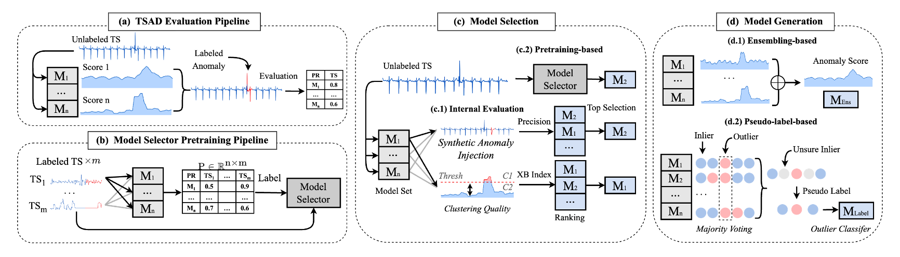

<h1 align="center">AutoTSAD</h1>
<h2 align="center">A Comprehensive Study of Automated Solutions for Time Series Anomaly Detection</h2>

## 📄 Contents
1. [Overview](#overview)
2. [Get Started](#start)
3. [AutoTSAD Benchmark](#autotsad)


<h2 id="overview"> 1. Overview </h2>

Time series anomaly detection is a fundamental data analytics task across scientific fields and industries. Despite significant attention from academia and industry in recent years, the effectiveness of the proposed anomaly detectors is restricted to specific domains. It is worth noting that a model that performs well on one dataset may not perform well on another. Therefore, how to select the optimal model for a particular dataset has emerged as a pressing issue. However, there is a noticeable gap in the existing literature when it comes to providing a comprehensive review of the ongoing efforts in this field. The evaluation of proposed methods across different datasets and under varying assumptions may create an illusion of progress. To date, there is no systematic evaluation conducted to assess the performance of these methods relative to each other. In this paper, we (i) review the existing literature on automated anomaly detection and provide a taxonomy; (ii) introduce a comprehensive benchmark AutoTSAD which comprises 18 different methods and 60 variants; (iii) conduct a systematic evaluation on 1918 different time series across 18 datasets collected from various domains. Our study uncovers a significant gap, where half of the proposed solutions to date do not statistically outperform a simple random choice. We also identify the challenges faced by existing approaches and outline potential research directions. To foster the development of new emerging solutions, we open-source our benchmark. Our aim for this study is to act as a catalyst, steering research efforts towards automated solutions in time series anomaly detection.

<p align="center">

</p>

Overview of AutoTSAD benchmark. We use $\mathrm{M_1}$, $\mathrm{M_2}$, and $\mathrm{M_n}$ to represent the candidate models. (a) depicts the standard evaluation pipeline for anomaly detectors. (b) depicts the pretraining pipeline for pretraining-based model selectors. (c) outlines the process for Model Selection which includes two main categories: (c.1) Internal Evaluation and (c.2) Pretraining-based Method. The output is the chosen anomaly detector that can then be applied to the time series data. (d) shows the approach for Model Generation which includes: (d.1) Ensembling-based and (d.2) Pseudo-label-based Methods. The result can be considered as an anomaly detector on its own.

<h2 id="start"> 2. Get Started </h2>


### 2.1 Installation

To install AutoTSAD from source, you will need the following tools:
- `git`
- `conda` (anaconda or miniconda)

**Step 1:** Clone this repository using `git` and change into its root directory.

```bash
git clone https://github.com/TheDatumOrg/AutoTSAD.git
```

**Step 2:** Create and activate a `conda` environment named `AutoTSAD`.

```bash
conda env create --file environment.yml
conda activate AutoTSAD
```

### 2.2 Usage

We provide a sample time series in `sample/` to help you get started,

#### (1) Internal Evaluation

```bash
python main.py -a [Method_name]
```
Available Method: EM&MV, CQ, MC, Synthetic

For example, if you choose `Synthetic` as the automated solution, then 
```bash
python main.py -a Synthetic
```
Then output is the anomaly score.

#### (2) Pretraining-based 

**Step 1:** Pretraining Pipeline
```bash
cd Pretraining_based/Pretraining_pipeline
```
Then follow the steps in the scripts to produce the training data and perform model selector pretraining.
We provide weights for some model selectors in `Pretraining_based/Pretrained_weights`.

**Step 2:** Apply Model Selection

```bash
python main.py -a UReg  # or any other pretraining-based model selectors
```

#### (3) Model Generation

```bash
python main.py -a OE_AOM  # or any other model generation techniques
```

<h2 id="autotsad"> 3. AutoTSAD Benchmark </h2>


### Candidate Model Set

A value of 1 in `Win` indicates using the max periodicity of the time series as the sliding window length, and 2 denotes the second-max periodicity. A value of 0 implies that we do not apply the sliding window strategy, with each time step processed individually. `Model Hyperparameter` outlines the different hyperparameter settings (see TSB for detailed definitions). We use a (Win, HP) tuple to specify hyperparameter configurations for each candidate model in `Candidate Model`.

| Method | Win        | Model Hyperparameter                                      | Candidate Model              |
|--------|------------|-----------------------------------------------------------|------------------------------|
| IForest| [0,1,2,3]  | n_estimators=[20, 50, 75, 100, 150, 200]                  | (3, 200), (1,100), (0,200)   |
| LOF    | [1,2,3]    | n_neighbors=[10, 30, 60]                                  | (3,60), (1,30)               |
| MP     | [1,2,3]    | cross_correlation=[False,True]                            | (2,False), (1,True)          |
| PCA    | [1,2,3]    | n_components=[0.25, 0.5, 0.75, None]                      | (3,None), (1,0.5)            |
| NORMA  | [1,2,3]    | clustering=[hierarchical, kshape]                         | (1,hierarchical), (3,shape)  |
| HBOS   | [1,2,3]    | n_bins=[5, 10, 20, 30, 40, 50]                            | (3,20), (1,40)               |
| POLY   | [1,2,3]    | power=[1, 2, 3, 4, 5, 6]                                  | (3,5), (2,1)                 |
| OCSVM  | [1,2,3]    | kernel_set=[linear, poly, rbf, sigmoid]                   | (1,rbf), (3,poly)            |
| AE     | [1,2,3]    | hidden_neuron=[[64, 32, 32, 64], [32, 16, 32]], norm=[bn, dropout] | (1,[32, 16, 32],bn), (2, [64, 32, 32, 64],dropout) |
| CNN    | [1,2,3]    | num_channel=[[32, 32, 40], [8, 16, 32, 64]] activation=[relu, sigmoid, tanh] | (2,[32, 32, 40],relu), (3,[8, 16, 32, 64],sigmoid) |
| LSTM   | [1,2,3]    | hidden_dim=[32, 64], activation=[relu, sigmoid]           | (1,64,relu), (3,64,sigmoid)  |


### Automated Solutions

`Variants` indicate different variations for each method. `TS` indicates whether the method is proposed for the time series scenario. `D` indicates whether it requires anomaly scores generated from the complete candidate model set. And `S` indicates the requirement of supervision from pretraining data.

| Method    | Reference                               | Variants                                       | TS      | D         | S      |
|-----------|-----------------------------------------|------------------------------------------------|---------|-----------|--------|
| EM&MV     | \[goix2016evaluate\]                    | [Excess-Mass, Mass-Volume]×2                   | ×       | ✓         | ×      |
| CQ        | \[nguyen2016evaluation\]                | [XB, Silhouette, R2, ...]×10                   | ×       | ✓         | ×      |
| MC        | \[ma2023need, goswami2022unsupervised\] | [1N, 3N, 5N]×3                                 | ✓       | ✓         | ×      |
| Synthetic | \[chatterjee2022mospat, goswami2022unsupervised\] | [sim. cutoff, orig. cutoff, ...]×12 | ✓ | ✓ | × |
| RA        | \[goswami2022unsupervised\]             | [Borda, Trimmed Borda]×6                       | ✓       | ✓         | ×      |
| CLF       | \[ying2020automated,sylligardos2023choose\] | [ID, OOD]×2                                | ✓       | ×         | ✓      |
| RG        | \[xu2008satzilla,jiang2024adgym\]       | [ID, OOD]×2                                    | ×       | ×         | ✓      |
| UReg      | \[navarro2023meta\]                     | [ID, OOD]×2                                    | ✓       | ×         | ✓      |
| CFact     | \[navarro2023meta\]                     | [ID, OOD]×2                                    | ✓       | ×         | ✓      |
| kNN       | \[nikolic2013simple,zhao2022toward,singh2022meta\] | [ID, OOD]×2                         | × | × | ✓ |
| MetaOD    | \[zhao2021automatic\]                   | [ID, OOD]×2                                    | ×       | ×         | ✓      |
| ISAC      | \[kadioglu2010isac\]                     | [ID, OOD]×2                                    | ×       | ×         | ✓      |
| OE        | \[aggarwal2015theoretical\]             | [Avg, Max, Avg of Max]×3                       | ×       | ✓         | ×      |
| UE        | \[zimek2014ensembles\]                  | 1                                              | ×       | ✓         | ×      |
| HITS      | \[ma2023need\]                          | 1                                              | ×       | ✓         | ×      |
| Aug       | \[hofmann2022demonstration, cao2023autood\] | [Majority Voting, Orig, Ens]×3            | × | ✓ | × |
| Clean     | \[cao2023autood\]                       | [Majority, Individual, Ratio, Avg]×4           | ×       | ✓         | ×      |
| Booster   | \[ye2023uadb\]                          | 1                                              | ×       | ×         | ×      |

